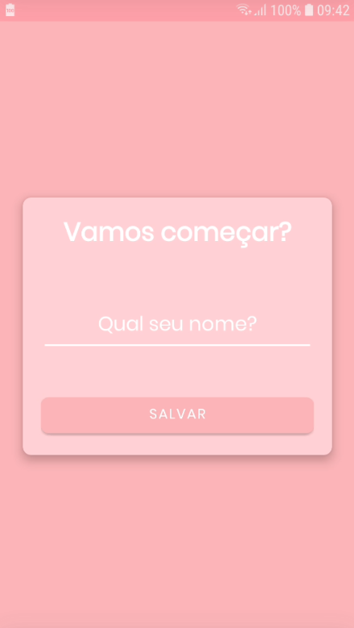
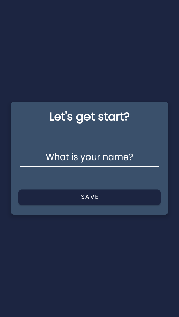
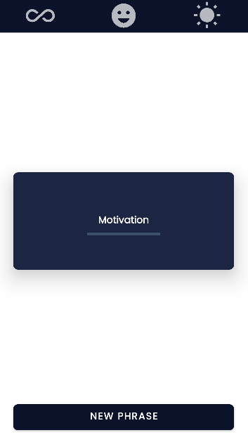

<h1 align="center">
    Motivation
</h1>

<p align="center">
   <a href="https://github.com/VictorGabrielMS">
    
  </a>
</p>

<p align="center">
  <a href="https://developer.android.com/?hl=pt-br">
    
  </a>
  <a href="https://kotlinlang.org/">
    
  </a>
</p>

## Motivation

- [About](#about)
- [The Application](#application)
- [Techs](#techs)
- [Clone and use for Free](#clone)

<a id="about"></a>

## :interrobang: About

<strong>Motivation:</strong> a mobile app created to fix some kotlin concepts.

<a id="application"></a>

## :sparkles: The Application

<h4 align="center">
    Light Theme
</h4>
<h3 align="center">
    
    
</h3>
<h4 align="center">
    DArk Theme
</h4>
<h3 align="center">
    
    
</h3>

<a id="techs"></a>

## :diamonds: Techs

The project was developed with the technologies below:

- [Kotlin](https://kotlinlang.org/)
- Android Shared Preferences
- View Binding
- Theme Context
- Language Internationalization


<a id="clone"></a>

## :octocat:Clone this repo

1. Clone :

```sh
  $ git clone https://github.com/VictorGabrielMS/motivation.git
```

2. Then open the folder on Android Studio and execute

## :memo: License

This project is under MIT LICENSE. for more details follow the link: [LICENSE](LICENSE).